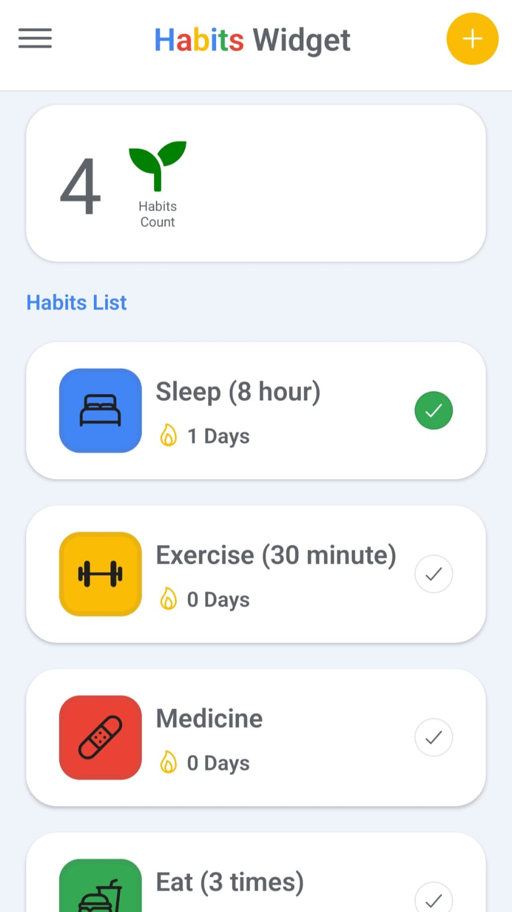
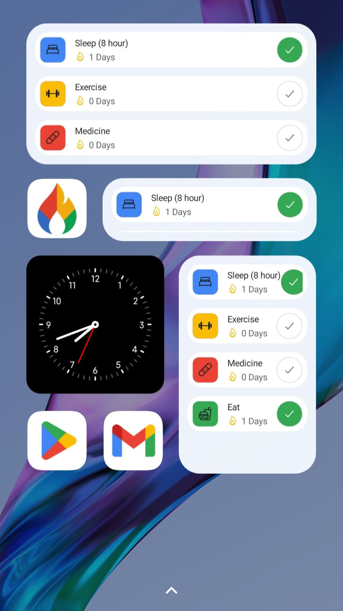

  

# Habits Widget

**A friendly habit tracker with a clean UI and Android home screen widgets.**

---

## Preview

  
  

---

## Why I built this

I wanted a simple habit tracker that feels lightweight, stays out of the way, and still keeps me accountable. The result is **Habits Widget** — a clean habit manager with quick create/edit flows and an Android widget for at‑a‑glance progress.

---

## What it can do

- **Track habits** with daily, weekly, or monthly schedules.
- **Streaks** that update when you complete a habit.
- **Emoji icons** to make your habits feel personal.
- **Android home screen widget** synced with the app.
- **Offline‑first** storage using AsyncStorage.

---

## How to run

* **On Android:** Download the latest APK from [Releases](https://github.com/ega-putra/habit-widget/releases)

---

### Support the project

Habits Widget is a solo-built habits widget app. It’s open-source, ad-free, and tracker-free—because building good habits and staying disciplined should be simple.

If this tool has saved you time or kept your data safe, please consider:
*   **Giving a Star:** It helps other people find the project.
*   **Spreading the word:** Share it with anyone who handles sensitive documents.

---

## Under the hood

- **Expo + React Native**
- **Expo Router**
- **AsyncStorage** for persistence
- **react-native-android-widget** for widgets
- **Ionicons** for iconography

---

*Made with care by [Ega Putra](https://github.com/ega-putra)*
